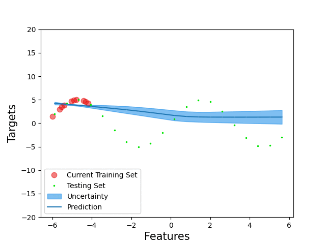
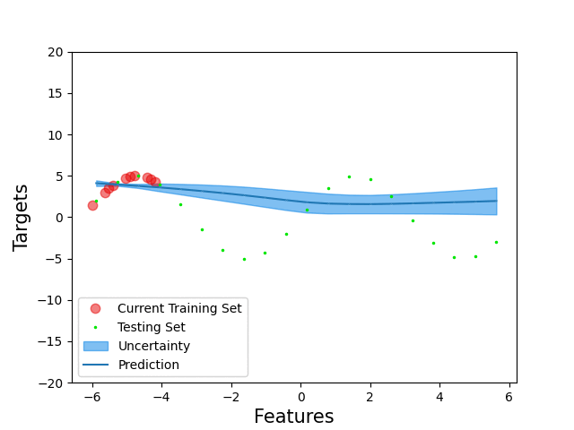
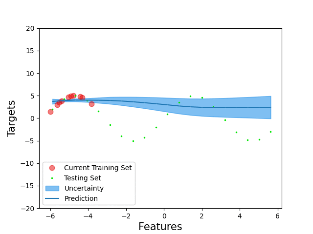
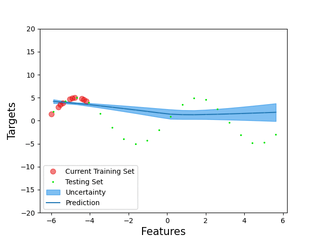
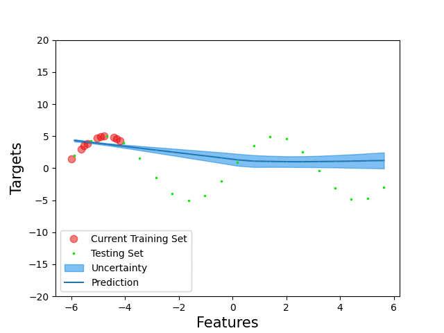
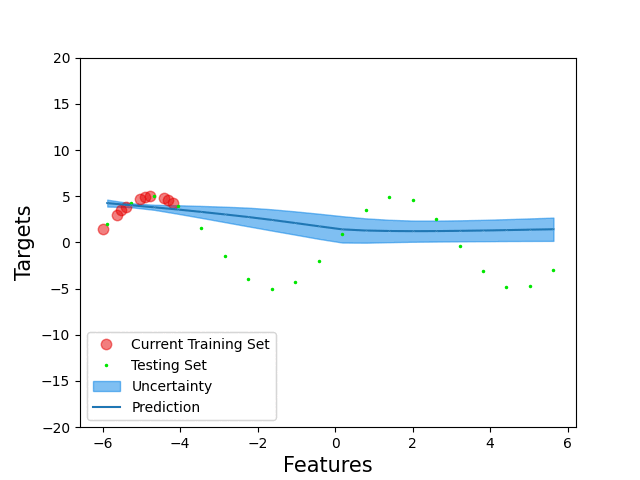

# Modeling of AUV Dynamics with Limited Resources: Efficient Online Learning Using Uncertainty

This repository contains additional visual content for the paper.

The paper presents point selection techniques, which are visualized here on a toy dataset. Note that points are served to the model one by one with increasing $x$. The model can accept or reject them. The mean prediction as well as uncertainty is predicted for each point on the degree.

For a more precise description of the point selection techniques, please refer to the paper.

## FIFO: First-In-First-Out

## FIRO: First-In-Random-Out

## RIRO: Random-In-Random-Out

## Greedy: In if Uncertainty Higher Than For Any Stored, Least Uncertainty Out

## Threshold: In if Over Threshold, Random Out

## Threshold-Greedy: In if Over Threshold, Least Uncertainty Out
